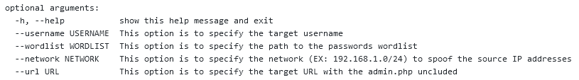

# NibbleBlog-Brute-Force
This is a simple brute force attack tool to use against NibbleBlog, it is specialized in bypassing the Blacklist Protection of NibbleBlog via X-Forwarded-For HTTP Header.

usage: nibbleblog-brute-force.py [-h] [--username USERNAME] [--wordlist WORDLIST] [--network NETWORK] [--url URL]

Simple NibbleBlog Brute Force Attack Tool

